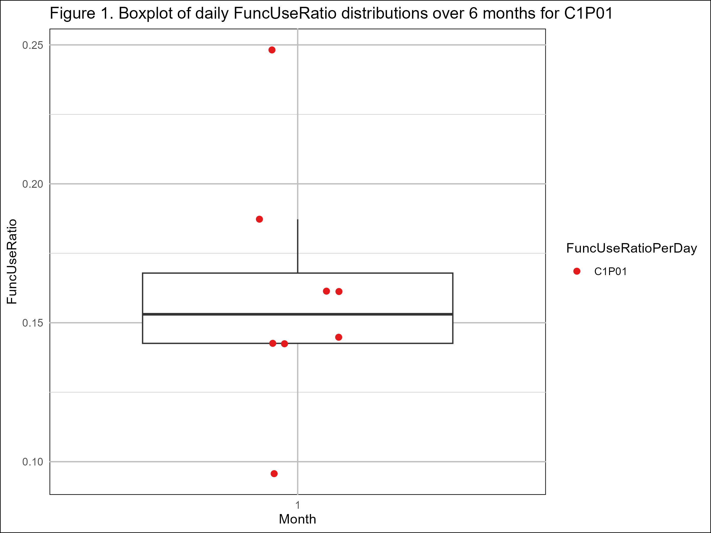
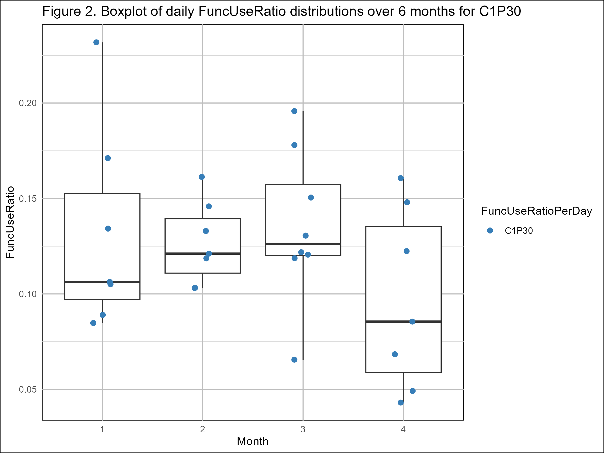
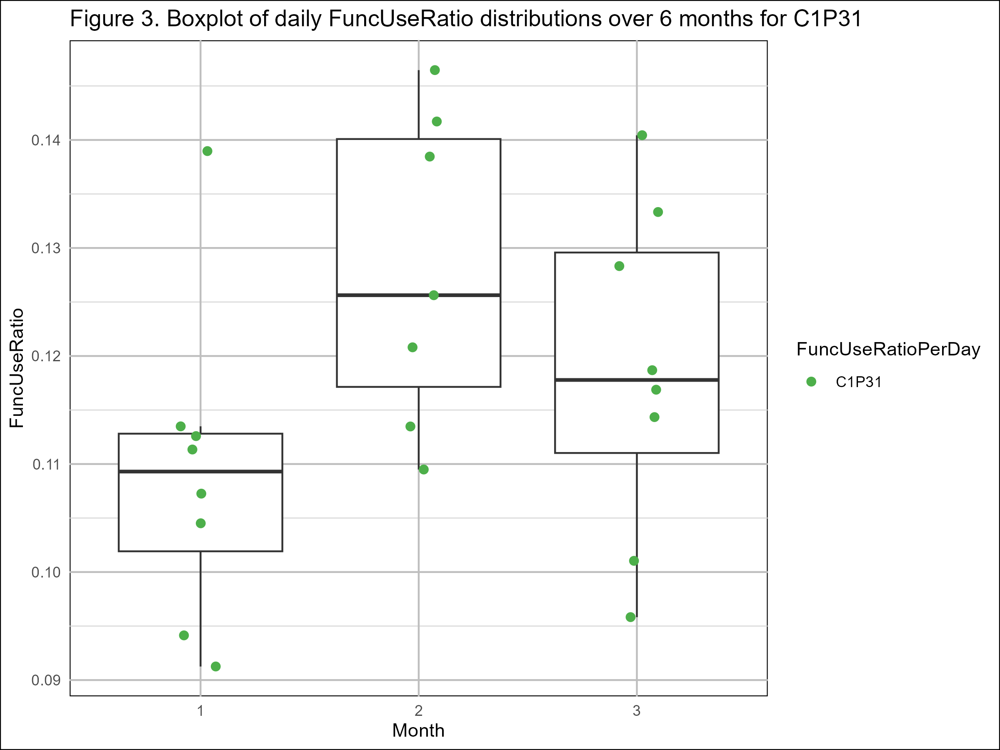
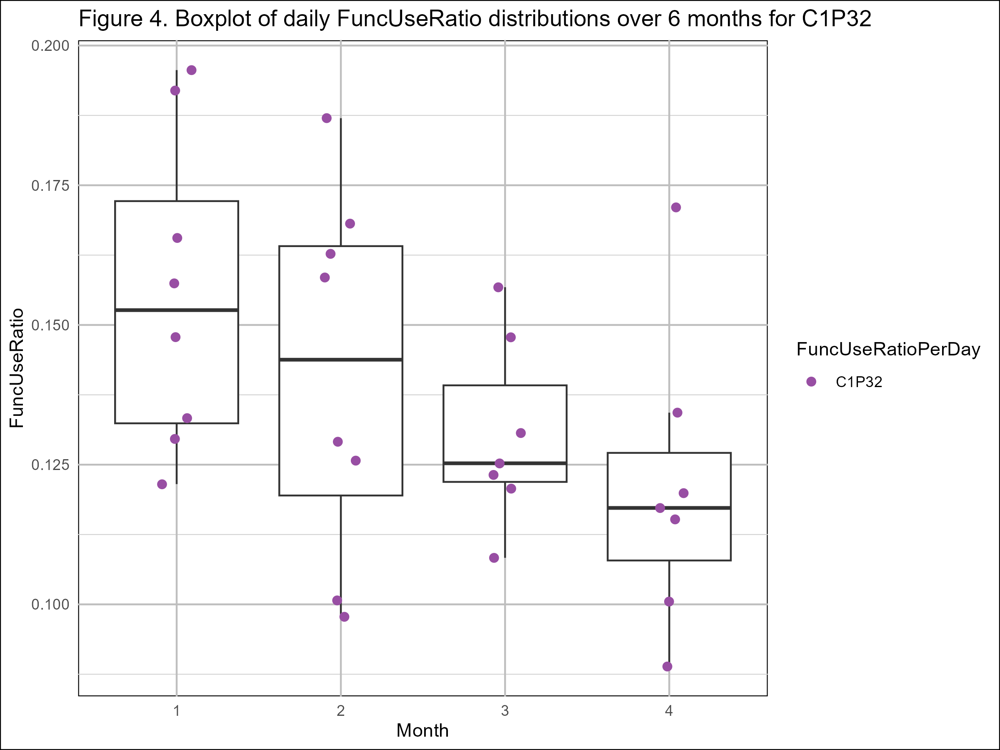
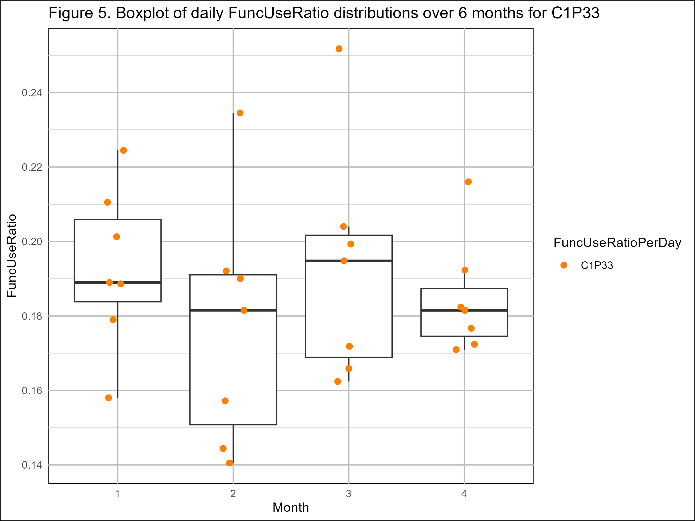

```{r, include=FALSE}
knitr::opts_chunk$set(error = TRUE, warning = FALSE)
```

# Actimetry and use of the paretic upper limb in post-stroke patients: Analysis of the variability of the FuncUseRatio


## 1. Scientific problem
### 1.1. Context
A stroke is an acquired brain injury caused by either the obstruction or hemorrhage of a blood vessel. It is the leading cause of acquired disability in France. Depending on the location and extent of the damage, the consequences of a stroke vary. One of the main consequences is upper limb motor impairment, known as paresis. Approximately 80% of hemiparetic individuals experience difficulties in performing daily life activities (Dusfour, 2023).  
According to Kleim and Jones (2008), motor recovery of the paretic upper limb improves with use, whereas non-use leads to loss of functional capacity: “Use it and improve it, or lose it.” After returning home, it is crucial for patients to use the paretic arm as much as possible. However, due to motor limitations, using the paretic arm requires greater effort and is often associated with failures and harmful compensatory movements. This fosters a phenomenon known as learned non-use (Taub et al., 2006).  

What we are looking for: Quantify the use of the paretic arm and assess nonuse at home with a reproducible and reliable measure.  

### 1.2. Aim
The aim of this study is to examine the intrapersonal variability of the FuncUseRatio, a metric that quantifies the functional use of the paretic upper limb based on accelerometric measurements in an ecological setting, over a six-month period in chronic post-stroke individuals to validate his reliability.

### 1.3. Method
Each participant wore an AX3 accelerometer (Axivity, Newcastle Helix, England, https://axivity.com/product/ax3) on each wrist at home for 7 consecutive days per month over six months. During these periods, participants were required to complete an activity journal, recording the start and end times of each activity performed. The wristbands containing the accelerometers were not removed during the 7-day recording period.

### 1.4. Participants
Five hemiparetic chronic-phase post-stroke patients participated in this study.

### 1.5. Outcome measure

$\text{FuncUseRatio} = \frac{\text{FuncUse of paretic UL}}{\text{paretic and non-paretic UL FuncUse}}$

*where FuncUse is the number of functional movements made with the arms. A functional movement of the upper limb satisfies two conditions: the arm elevation angle must be greater than 30°, and the movement must occur within a range of -30° to +30° around the horizontal plane (Leuenberger, 2017).*  

---

## 2. Aim of the code
The objective of this code is to analyze the temporal variability of the FuncUseRatio metric for each patient across six months. The analysis includes visualization, reliability assessment via the Intraclass Correlation Coefficient (ICC), and variability quantification via the Coefficient of Variation (CV).

---

## 3. Data organization
**File:** `results_FuncUsePerDay_all_patients_filtered.csv`  
**Columns:**  
- `ID` : Patient ID (e.g., C1P30 corresponding to investigation center 1 and the 30th patient included in the study)  
- `month` : Month of recording (from 1 = first month to 6 = sixth month)  
- `day` : Day of recording (from 1 = first day to 8 = eighth day)  
- `FuncUse_non_paretic_day` : Number of functional movements of the non-paretic arm  
- `FuncUse_paretic_day` : Number of functional movements of the paretic arm  
- `FuncUseRatio_day` : Daily FuncUseRatio 

---

## 4. Script organization
### 4.1. Visualization of daily FuncUseRatio distributions (section 5.2) 
- **Aim:** To visualize the distribution of dailies FuncUseRatio for each patient over the six months.
- **Input:** `results_FuncUsePerDay_all_patients_filtered.csv` in `data` folder
- **Output:** `boxplot_FuncUseRatio_CXPXX.png` saved in the `results` folder: Boxplots showing the distribution of dailies FuncUseRatio across the six months for each patient.  

### 4.2. Intraclass Correlation Coefficient (ICC) (section 5.3)
- **Aim:** To measure the reliability of FuncUseRatio values over six months by quantifying the consistency of repeated measurements for the same patient.
- **Input:** `results_FuncUsePerDay_all_patients_filtered.csv` in `data` folder
- **Calculation:**  ICC(2,1) model is used, which assumes that the subjects and the months are a random effect.  
$$
\text{ICC(2,1)} = \frac{MS_R - MS_E}{MS_R + (k - 1) \cdot MS_E + \frac{k}{n} (MS_C - MS_E)}
$$
*where:*    
\( MS_R \) *is the variance between subjects*  
\( MS_C \) *is the variance between FuncUseRatio across months*  
\( MS_E \) *is the residual error variance*  
\( n \) *is the number of subjects*  
\( k \) *is the number of FuncUseRatio across months per subject*   
- **Output:**  ICC value and 95% confidence interval, indicating the degree of agreement between FuncUseRatio measurements across months.  

### 4.3. Coefficient of Variation (CV) (section 5.4) 
- **Aim:** To assess the relative dispersion of FuncUseRatio measurements by calculating the ratio between the standard deviation and the mean.
- **Input:** `results_FuncUsePerDay_all_patients_filtered.csv` in `data` folder
- **Calculation:** 
$$
CV = \frac{\sigma}{\mu} \times 100
$$
*where:*  
\( \sigma \) *is the standard deviation of FuncUseRatio measurements*  
\( \mu \) *is the mean of FuncUseRatio.*  
- **Output:** CV value for each patient, indicating the degree of variability in FuncUseRatio measurements across months.

---

## 5. Code

### 5.1. Setup
These cells load the required libraries for the analysis and the dataset, and ensures that the columns are in the correct format for analysis.

```{r}
# Install required libraries

# If some of these libraries are already installed and you don't want to install 
# them back, please comment concerned lines in this block

# install.packages("ggplot2")
# install.packages("dplyr")
# install.packages("RColorBrewer")
# install.packages("tidyr")
# install.packages("psych")
# install.packages("knitr")
```


```{r, message=FALSE, warning=FALSE}
# Load required libraries
library(ggplot2)
library(dplyr)
library(RColorBrewer)
library(tidyr)
library(psych)
library(knitr)
```

```{r, message=FALSE, warning=FALSE}
# Load dataset
df_filtered <- read.csv("./data/results_FuncUsePerDay_all_patients_filtered.csv")

# Ensure columns are in the correct format
df_filtered$month <- as.factor(df_filtered$month)
df_filtered$ID <- as.factor(df_filtered$ID)
```

### 5.2. Visualization of daily FuncUseRatio distributions
We start by creating boxplots for each patient to show the distribution of daily FuncUseRatio values across six months. Each dot represents the daily FuncUseRatio, i.e. FuncUseRatioPerDay : the FuncUseRatio of one recording day. For each month, we have an average of 7 days of recording.

```{r}
# Define colors for patients
colors <- RColorBrewer::brewer.pal(n = length(unique(df_filtered$ID)), name = "Set1")

# Initialize figure counter
figure_number <- 1

# Generate and save plots per patient
for (patient_id in unique(df_filtered$ID)) {
  
  # Filter the data for the current patient
  patient_data <- df_filtered[df_filtered$ID == patient_id, ]
  
  # Create the boxplot for the current patient
  p <- ggplot(patient_data, aes(x = month, y = FuncUseRatio_day, group = month)) +
    geom_boxplot(outlier.shape = NA) +  
    geom_jitter(aes(color = ID), width = 0.1, size = 2) +  
    theme_minimal() +  
    theme(panel.background = element_rect(fill = "white"),  
          plot.background = element_rect(fill = "white"),  
          panel.grid.major = element_line(color = "gray", size = 0.5),  
          panel.grid.minor = element_line(color = "lightgray", size = 0.25),  
          axis.text.x = element_text(angle = 0, hjust = 0.5),  
          panel.grid.major.x = element_line(color = "gray", size = 0.5),  
          panel.grid.minor.x = element_line(color = "lightgray", size = 0.25)) +  
    labs(title = paste0("Figure ", figure_number, ". Boxplot of daily FuncUseRatio distributions over 6 months for ", patient_id),
         x = "Month",  
         y = "FuncUseRatio") +  
    scale_color_manual(values = setNames(colors, unique(df_filtered$ID))) +  
    guides(color = guide_legend(title = "FuncUseRatioPerDay", labels = "FuncUseRatioPerDay"))  
  
  # Save the plot as a PNG file for each patient
  ggsave(paste0("./results/boxplot_FuncUseRatio_", patient_id, ".png"), plot = p, width = 8, height = 6, bg = "white")
  
  # Increment figure number
  figure_number <- figure_number + 1
}
```

{width=75%}

{width=75%}

{width=75%}

{width=75%}

{width=75%}


---

### 5.3. Intraclass Correlation Coefficient (ICC)
The Intraclass Correlation Coefficient (ICC) is calculated to assess the reliability of FuncUseRatio measurements across the six months for each patient. The ICC value ranges from 0 to 1, where values closer to 1 indicate high reliability and values closer to 0 indicate low reliability. 
The ICC(2,1) model is used, which assumes that the subjects and the months are a random effect. This model is appropriate for our data structure, where we have repeated measurements for each patient across different months.

#### 5.3.1. Prepare data for ICC calculation
This section prepares the data for ICC calculation by creating a new dataframe that contains the mean FuncUseRatio for each patient and month. 
```{r, message=FALSE, warning=FALSE}
# Prepare data (mean FuncUseRatio for each patient and month)
monthly_means_df <- df_filtered %>%
  group_by(ID, month) %>%
  summarise(mean_FuncUseRatio = mean(FuncUseRatio_day, na.rm = TRUE))
```
The data is then reshaped from long to wide format, where each column represents a month and each row represents a patient.
```{r}
# Long format table
kable(monthly_means_df, caption = "**Table 1.** Mean FuncUseRatio by patient and month (long format)")

# Convert long to wide data format
wide_monthly_means_df <- monthly_means_df %>%
  pivot_wider(names_from = month, values_from = mean_FuncUseRatio)

# Wide format table
kable(wide_monthly_means_df, caption = "**Table 2.** Mean FuncUseRatio by patient and month (wide format)")
```

#### 5.3.2. Compute ICC
This section computes the ICC using the `psych` package. The `ICC()` function is applied to the wide dataframe, excluding the first column (ID) since it is not needed for the calculation.
```{r, message=FALSE, warning=FALSE}
# Calculate ICC
icc_result <- ICC(wide_monthly_means_df[ , -1])
```
#### 5.3.3. ICC results and summary
This cell prints the ICC results of interest, including the ICC value, confidence intervals, and interpretation.
```{r}
# Print the ICC results
kable(icc_result$results[icc_result$results$type == "ICC2", ], 
      caption = "**Table 3.** ICC results for FuncUseRatio over six-months")
```

#### 5.3.4. Interpretation  

The ICC ranges from 0 to 1 and measures consistency or agreement across repeated measurements (here: sessions/months for the same patient).

This value reflects the proportion of total variance in the FuncUseRatio that is attributable to differences between patients.

The general interpretation scale of ICC values is as follows:  
- < 0.5: Poor reliability  
- between 0.5 and 0.75: Moderate reliability  
- between 0.75 and 0.9: Good reliability  
- > 0.9: Excellent reliability  

The ICC value, using a linear mixed-effects model with month and subjects as a random effect, obtained in this study was 0.82 (95% CI: 0.49-0.98, p<0.05), indicating a good level of reliability, statistically significant, in the FuncUseRatio measurements across the six-month period for the patients included in this study. This suggests that the majority of the variance in FuncUseRatio, 82%, is attributable to differences between patients rather than within-patient fluctuations over time. In other words, each patient's pattern of functional use remained highly consistent, supporting the stability of this metric as a reliable measure of functional activity in the absence of intervention.

---

### 5.4. Coefficient of Variation (CV)
The Coefficient of Variation (CV) is calculated to assess the relative variability of FuncUseRatio measurements across the six months for each patient. The CV is defined as the ratio of the standard deviation to the mean, expressed as a percentage. A higher CV indicates greater variability in FuncUseRatio measurements.

#### 5.4.1. Perform the CV calculation
This section calculates the CV based on the monthly means for each patient. The mean and standard deviation of FuncUseRatio are computed for each patient.
```{r, message=FALSE, warning=FALSE}
# Calculate the CV based on monthly means for each patient
cv_results <- monthly_means_df %>%
  group_by(ID) %>%
  summarise(
    mean = mean(mean_FuncUseRatio),  
    SD = sd(mean_FuncUseRatio),  
    CV = (SD / mean) * 100  
  )
```

#### 5.4.2. CV results
This cell prints the CV results for each patient, including the mean monthly FuncUseRatio, standard deviation, and CV value.
```{r}
# Save the table in a .csv file
write.csv(cv_results, "./results/cv_results.csv", row.names = FALSE)

# CV results table (HTML file)
kable(cv_results, caption = "**Table 4.** Coefficient of Variation (CV) results")

# CV results table (Rstudio)
if (interactive()) {
  print(cv_results)
}
```

#### 5.4.3. Interpretation   

The CV of the daily FuncUseRatio across 6 sessions ranged from 4.01% to 14.34% depending on the patient. These values reflect the degree of relative variability in the FuncUseRatio over time.

The general interpretation scale of CV values is as follows:  
- < 10%: Low variability  
- between 10% and 20%: Moderate variability  
- > 20%: High variability  

The CV values obtained in this study, < 10% for two patients and between 10 and 20% for the two others patients indicate that the FuncUseRatio measurements exhibit a low to moderate level of variability across the six months for the patients included in this study. This suggests that the functional use of the paretic arm remains relatively stable over the six-month period for these subjects.
One subject doesn't have enough data to calculate the CV.

---

## 6. Conclusion

The analysis of the FuncUseRatio over six consecutive months in post-stroke patients reveals that:

- The ICC value demonstrates good test-retest reliability (ICC between 0.75 and 0.9), indicating that the FuncUseRatio remains highly stable over time within each patient. 

- The CV values are below 20% for four patients, indicating low to moderate intra-individual relative variability.  

Together, these results support the conclusion that FuncUseRatio is a consistent and reliable metric for assessing upper limb use in daily life among chronic stroke patients. This is consistent with the fact that, in the absence of intervention, motor deficits tend to remain relatively stable in the chronic phase of stroke.  
It may serve as a valuable outcome metric for long-term monitoring of spontaneous arm use at home.

---
## 7. References
ClinicalTrials.gov. (2024). *Actimetry Monitoring of the Paretic Upper Limb in Chronic Post Stroke. (ParUse).* https://clinicaltrials.gov/study/NCT05581602locStr=Montpellier,%20France&country=France&state=Occitanie&cit=Montpellier&cond=Stroke,%20Chronic&rank=3

Dusfour et al. (2023). Comparison of wrist actimetry variables of paretic upper limb use in post stroke patients for ecological monitoring. *Journal of NeuroEngineering and Rehabilitation.* 20:52 https://doi.org/10.1186/s12984-023-01167-y

Kleim, J. A., & Jones, T. A. (2008). Principles of experience-dependent neural plasticity: implications for rehabilitation after brain damage. *Journal of speech, language, and hearing research : JSLHR, 51*(1), S225–S239. https://doi.org/10.1044/1092-4388(2008/018) 

Leuenberger, K., Gonzenbach, R., Wachter, S. et al. (2017). Une méthode pour évaluer qualitativement l'utilisation des bras chez les survivants d'un AVC à domicile. *Med Biol Eng Comput 55,* 141-150. https://doi.org/10.1007/s11517-016-1496-7

Taub, E., Miller, N. E., Novack, T. A., Cook, E. W., Fleming, W. C., Nepomuceno, C. S., Connell, J. S., & Crago, J. E. (1993). *Technique to improve chronic motor deficit after stroke. Archives of Physical Medicine and Rehabilitation, 74*(4), 347‐354. https://pubmed.ncbi.nlm.nih.gov/8466415/
